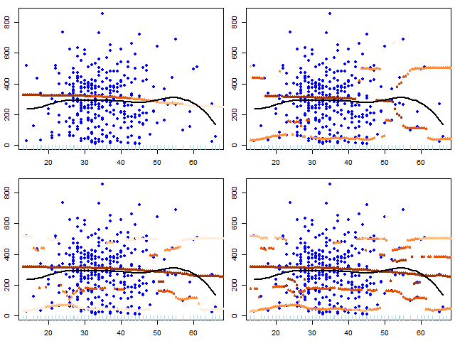
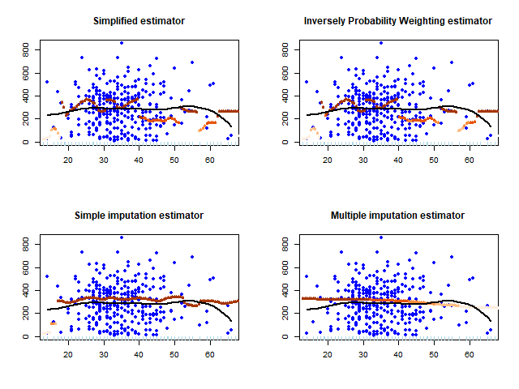
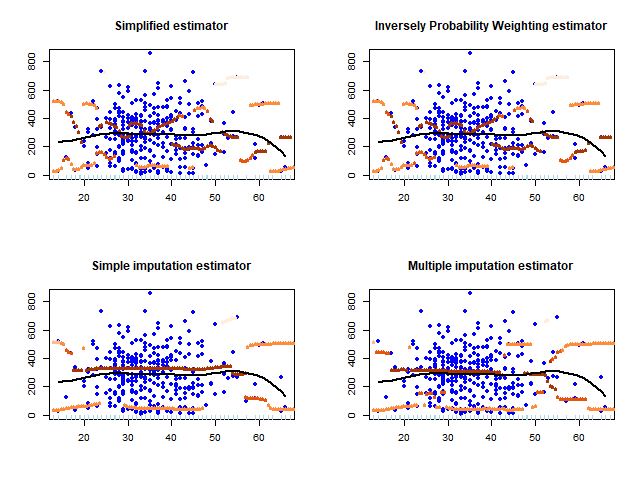
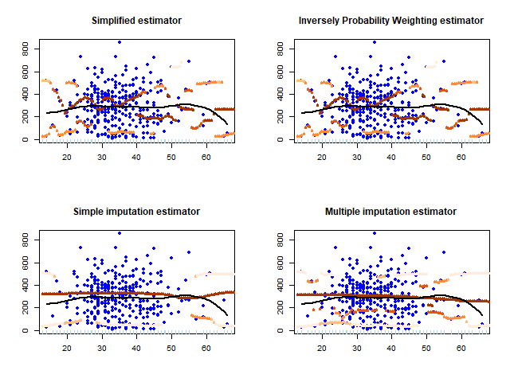
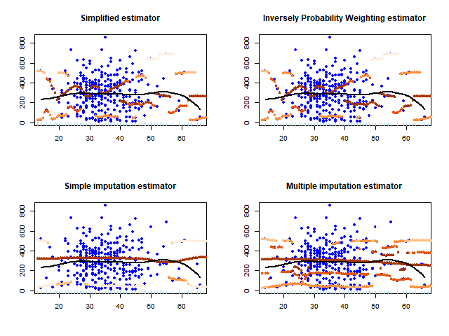

# Supplementary material for Nonparametric modal regression with missing observations in response (NP-Modal-Reg-Missing-Y)

Supplementary codes and data used in paper @PerezGonzalez2025

Please cite this paper as:

```         
@article{PerezGonzalez2025,
  title={Nonparametric modal regression with missing observations in response},
  author={Ana Pérez-González, Tomás R. Cotos-Yañez and Rosa M. Crujeiras},
  journal={},
  year={2025}
}
```

# R packages

In order to use paper implementation and run all files (numerical and real examples), the following prerequisites (packages) are needed:

```{r , eval = FALSE}
pkg<-c("hdrcde", "nor1mix","multimode", "np", "lpme", "pracma", "sm",
       "BART")
install.packages(pkg)
```

In order to compile C code is necessary:

```{r , eval = FALSE}
pkg <- c("RcppArmadillo", "inline")
install.packages(pkg)
```

In order to obtain the graphics

```{r , eval = FALSE}
pkg <- c("rgl", "RColorBrewer", "ggplot2", "gridExtra", "reshape2")
install.packages(pkg)
```

# Simulation (Numerical Studies)

-   `escenario1.R`, `escenario2.R`, `escenario3.R`, `escenario4.R`: Code of scenario 1 -- 4 for all simulations.

    -   Simplified estimator (S)
    -   Inversely Probability Weighting estimator (IPW)
    -   Imputed simple estimator (IS)
    -   Imputed multiple estimator (IM)

-   `sim-escenario1-missing-1.R`, `sim-escenario1-missing-2.R`, `sim-escenario1-missing-3.R`, `sim-escenario1-missing-4.R`, scripts of scenario 1 with the parameters for each missing data mode given by:

    -   M1: $p\left(x\right)=0.6+0.3\cos(\pi x)$
    -   M2: $p\left(x\right)=0.6+0.3\cos(2 \pi x)$
    -   M3 $p\left(x\right)=0.7+0.3\cos(2\pi x^2)$
    -   M4 $p\left(x\right)=0.75$

-   idem for all other scenarios.

## 1. Study of HIV-AIDS

Our first example is the `ACTG 175` dataset available from the R-package `BART` @JSSv097i01. To develop our analysis, conditional modes of `CD4` count at $96\pm 5$ weeks (response variable) were estimated given `age` variable. The number of missing observations in the response is 211 (about $39.7\%$ of the sample).

```{r , eval =T,message=F,warning=F}
library(BART)
data(ACTG175)
  datos <- ACTG175[ACTG175$arms==0,c("age","cd496")]
  summary(datos)
```

The achievement of this work is the study of the behavior of missing data mechanisms in the response to modal regression. Several methodologies of missing data literature are adapted to this situation: complete case analysis, inverse probability weighting, simple imputation or multiple imputation.

Smooth bidimensional estimator of (`age`,`cd496`). Similar to histogram of Figure 9.

```{r , eval =T,message=F,warning=F,echo=FALSE}
library(ggplot2)
library(gridExtra)
library(reshape2)
library(sm)
library(BART)

data(ACTG175)
dat <- ACTG175[ACTG175$arms==0,]
dat <- dat[complete.cases(dat),]
# cd496: 211 datos missing de 532
  p <- ggplot(dat,aes(x=age,y=cd496))
  p + geom_point() + 
    stat_density2d(aes(alpha=..density..), #h=c(5,100),
                   geom="tile",contour=FALSE)
```

The corresponding plot are displayed in Figure 8 of paper.



Figure 8: Conditional modes with multiple imputation of cd496 given age with modes number 1,2,3,4 (from top left corner to bottom right corner) respectively. Smooth regression estimates in black (with only complete cases), and modal regression in orange. Orange light colors are shown for low density values and orange dark colors for high density values.



Conditional modes of $\texttt{cd496}$ given $\texttt{age}$ with mode number 1. Smooth regression estimates in black (with only complete cases), and modal regression in orange. Orange light colors are shown for low density values and orange dark colors for high density values.



Conditional modes of $\texttt{cd496}$ given $\texttt{age}$ with mode number 2. Smooth regression estimates in black (with only complete cases), and modal regression in orange. Orange light colors are shown for low density values and orange dark colors for high density values. 

Conditional modes of $\texttt{cd496}$ given $\texttt{age}$ with mode number 3. Smooth regression estimates in black (with only complete cases), and modal regression in orange. Orange light colors are shown for low density values and orange dark colors for high density values.



Conditional modes of $\texttt{cd496}$ given $\texttt{age}$ with mode number 4. Smooth regression estimates in black (with only complete cases), and modal regression in orange. Orange light colors are shown for low density values and orange dark colors for high density values.


-   `/RealDataApplications/cd496.R`: Code for HIV-AIDS data example.

```{r , eval = F}
source("/RealDataApplications/Example 1. Study of HIV-AIDS.R")
```

## 2. Maximum surface temperature

Now, we have analysed daily data from the ocean-meteorological buoy near the Cies Islands, located in the municipality of Vigo. (Spain) (lon/lat: -8°53.59’,42°10.69’). The floating device collects data from different measurements. One of them is the daily maximum surface temperature, which had a 23.01% percentage of missing data in 2021.

Our objective is to study the relation between the daily maximum surface temperature (`Y`) and the average air temperature (`X`). In order to eliminate the temporal dependence, data each 3 days are selected.

```{r , eval = T}
arquivo <-  "RealDataApplications/2021 Boia de Cíes - datos diarios.txt"
datos <- read.table(arquivo, sep="\t", dec=",")
nomes <- paste("Var",0:25,sep="")
colnames(datos) <- c("data",nomes)                    
# Transformar -9999 en missing
datos[datos==-9999] <- NA
ii <- seq(1,nrow(datos),by=3)
df <- data.frame(x=datos$Var1[ii], y=datos$Var18[ii])
  df <- df[complete.cases(df$x),]
  summary(df)
  dim(df)

# high computational time
# mm <- modal.fit.missing(x=df$x,y=df$y,nstart=2, p.order=0,
#                        H= c(1,1),
#                        xnew=seq(min(df$x), max(df$x), length=100))
```

The corresponding plot is displayed in Figure 9 of paper.

## References
